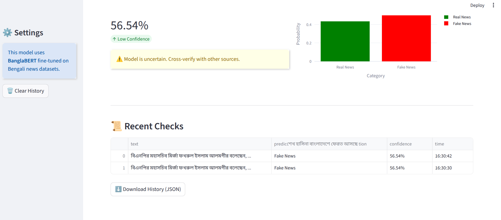

# 📰 Bengali Fake News Detection System

A Streamlit-based web application for detecting fake news in Bengali using a fine-tuned XLM-RoBERTa  model.


## 📸 Screenshots

### Main Interface


### Prediction Results



## 🌟 Features

- **Real-time News Verification**: Analyze Bengali news articles instantly
- **Confidence Scoring**: Get probability scores for predictions
- **Interactive Visualization**: View prediction probabilities with interactive charts
- **History Tracking**: Keep track of all your recent verifications
- **Export Functionality**: Download verification history as JSON
- **User-friendly Interface**: Clean and intuitive Streamlit UI

## 🚀 Getting Started

### Prerequisites

- Python 3.8 or higher
- pip package manager

### Installation

1. **Clone the repository**
```bash
git clone <repository-url>
cd bengali-fake-news-detection
```

2. **Install required dependencies**
```bash
pip install -r requirements.txt
```

3. **Download or prepare the model**
   - Ensure you have the trained model saved in a folder named `multilingual_bert_fake_news_model`
   - Or update the `model_dir` variable in the code to point to your model location/HuggingFace model ID

### Required Dependencies

Create a `requirements.txt` file with the following:

```
streamlit==1.51.0
transformers==4.35.0
tensorflow==2.12.0
tf-keras==2.12.0
pandas==2.3.3
numpy==1.27.4
plotly==6.5.0
joblib==1.5.2
matplotlib==3.10.7
seaborn==0.13.2
wordcloud==1.9.4
scikit-learn==1.7.2

```

## 💻 Usage

1. **Start the application**
```bash
streamlit run roberta.py
streamlit run app.py
```

2. **Access the web interface**
   - The app will automatically open in your default browser
   - Default URL: `http://localhost:8501`

3. **Verify news articles**
   - Paste Bengali news text in the input area
   - Click "🚀 Verify News" button
   - View the prediction results and confidence score

## 📊 Model Information

- **Base Model**: XLM-RoBERTa (Multilingual BERT)
- **Fine-tuning**: Trained on Bengali news datasets
- **Classes**: 
  - Real News (0)
  - Fake News (1)
- **Input**: Bengali text (max 512 tokens)
- **Output**: Binary classification with confidence scores

## 🎯 Features Breakdown

### Main Interface
- Text input area with word count
- Real-time prediction with progress indicator
- Color-coded results (Green for Real, Red for Fake)
- Confidence metric with threshold warnings

### Visualization
- Interactive Plotly bar chart showing probability distribution
- Confidence level indicators
- Warning for low-confidence predictions (<60%)

### History & Export
- Track recent verifications with timestamps
- View history as a styled dataframe
- Export history to JSON format

## ⚙️ Configuration

### Model Path
Update the model directory in the code:
```python
model_dir = "multilingual_bert_fake_news_model"  # Change this to your model path
```

### Confidence Threshold
Modify the warning threshold:
```python
if confidence < 0.6:  # Adjust this value as needed
    st.warning("⚠️ Model is uncertain.")
```

## 🛠️ Troubleshooting

### Model Loading Error
- Ensure the model directory exists and contains all required files
- Check if the model was saved correctly during training
- Verify the model is compatible with the TensorFlow version

### Memory Issues
- For large models, consider using model quantization
- Reduce `max_length` parameter if needed
- Use GPU for faster inference

### Dependencies
- If you encounter TensorFlow issues, try:
  ```bash
  pip install tensorflow --upgrade
  ```

## 📁 Project Structure

```
bengali-fake-news-detection/

├── app.py                              # Main Streamlit application
├── README.md                           # Project documentation
├── requirements.txt                    # Python dependencies
│
└── multilingual_bert_fake_news_model/  # Model directory
    ├── config.json
    ├── tf_model.h5
    ├── tokenizer_config.json
    └── vocab.txt
```

## 🤝 Contributing

Contributions are welcome! Please feel free to submit a Pull Request.

1. Fork the project
2. Create your feature branch (`git checkout -b feature/AmazingFeature`)
3. Commit your changes (`git commit -m 'Add some AmazingFeature'`)
4. Push to the branch (`git push origin feature/AmazingFeature`)
5. Open a Pull Request

## 📝 License

This project is licensed under the MIT License - see the LICENSE file for details.

## 👥 Authors

Rifat Sarker - Initial work

## 🙏 Acknowledgments

- BanglaBERT/XLM-RoBERTa model developers
- Streamlit for the amazing framework
- HuggingFace Transformers library
- Bengali NLP community

## 📧 Contact

For questions or feedback, please contact: [rifatsarkercse@example.com]

## 🔮 Future Enhancements

- [ ] Add multilingual support
- [ ] Implement batch processing
- [ ] Add source credibility checking
- [ ] Include fact-checking references
- [ ] Deploy to cloud platform
- [ ] Add API endpoints
- [ ] Implement user authentication
- [ ] Add detailed analytics dashboard

## ⚠️ Disclaimer

This tool is designed to assist in identifying potentially false information but should not be the sole determinant of news authenticity. Always cross-verify information from multiple reliable sources.

---

**Made with ❤️ for fighting misinformation in Bengali media**
